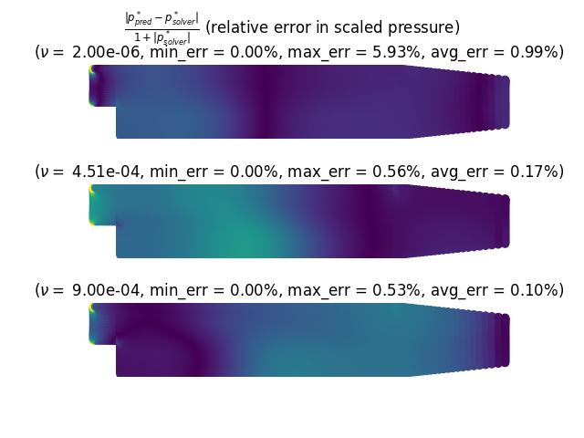

# SVD for linear regression on pressure field from OpenFOAM simulations

This is a small example on how to use SmartSim/SmartRedis with OpenFOAM
solvers to predict pressure distribution based on viscosity values for
the `pitzDaily` case (Proof of concept at best; The objective was to establish
a workflow, not really interested in the specific results).


Two Key points:
- This needs a customized version of [SmartSim](https://github.com/FoamScience/SmartSim/tree/multi_step_jobs),
  track the progress of merging needed features into SmartSim here: CrayLabs/SmartSim#251
- If you want to try out the custom version, you can simply
  ```bash
  # Do this if you already have a version of smarsim installed  along with everything else
  pip3 install git+https://github.com/FoamScience/SmartSim@multi_step_jobs#egg=smartsim
- `````
- The input case [input/pitzDaily](input/pitzDaily)
  has a "tagged" `constant/transportProperties` which uses the target parameter (`;nu;`) for parameter
  variation on viscosity
- In addition to the pressure field, the [custom solver](/2023-01/smartsim/smartredis-simpleFoam/simpleRedisFoam)
  also sends out X and Y components of cell centers
  to the Redis DB sowe can produce nice visualizations.
- The python script which drives the study generates cases, runs `blockMesh` then the custom solver
  on each case, registering the resulting pressure field to the Redis database. After all training simulations
  are done, an SVD function trains its parameters on the pressure fields generated so far which are then
  used to predict the pressure distribution on a new set of viscosity values. Those same viscosity values
  are plugged back into the OpenFOAM cases for verification purposes (relative percentage error in the prediction
  is then displayed).



